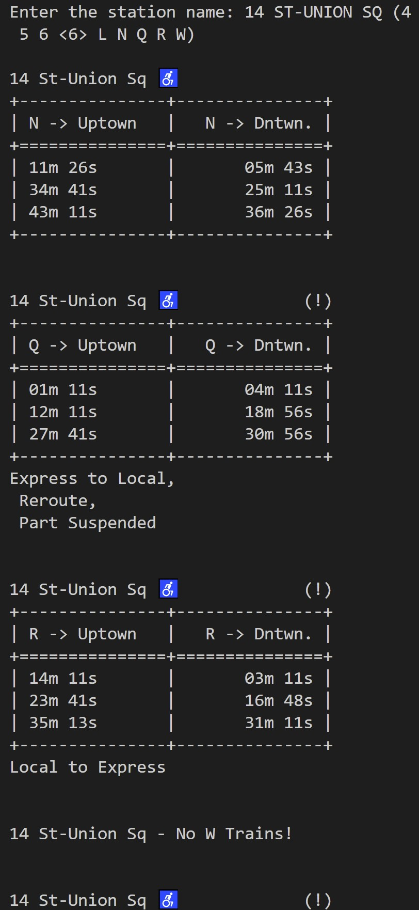
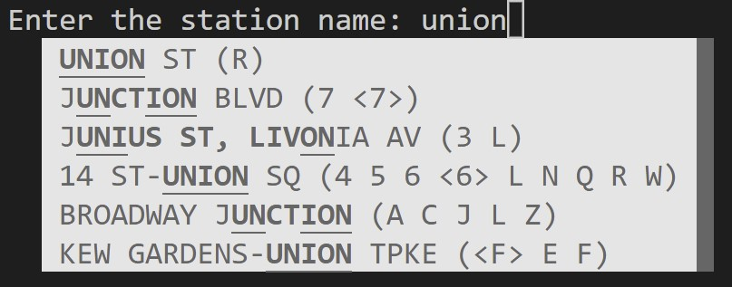
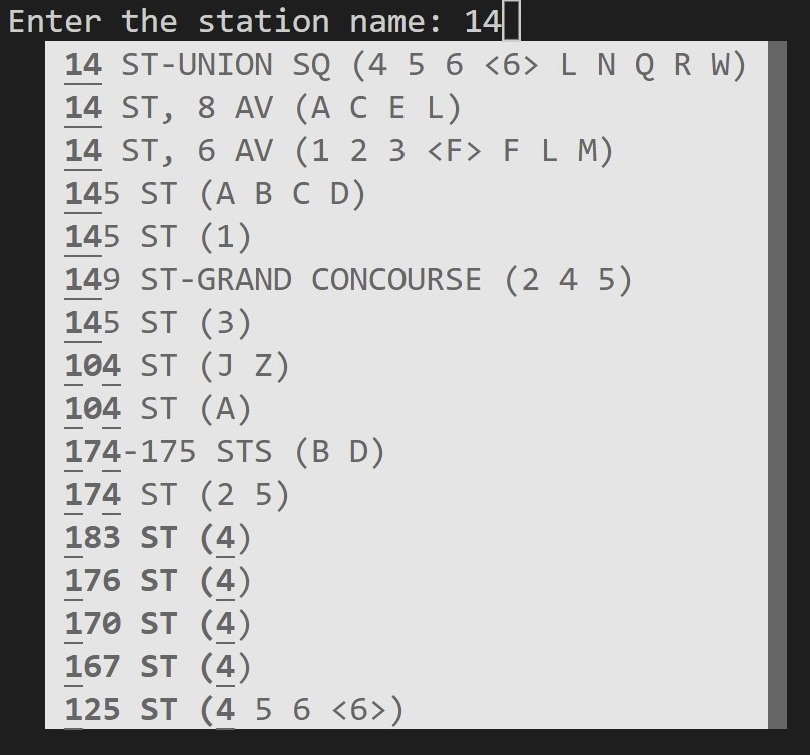
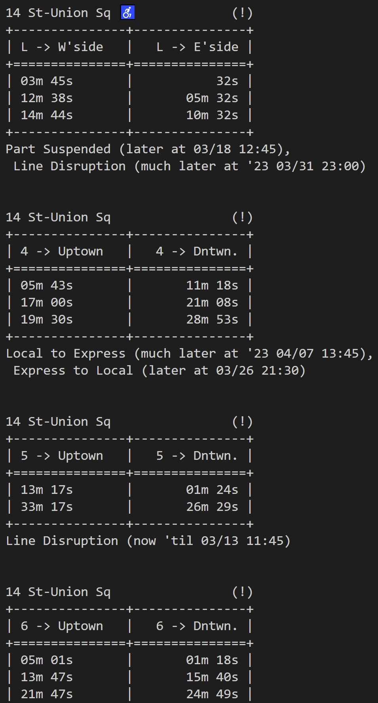

# nyc-subway-time

## Short Description<br>

A CLI Python program showing arrival times &amp; service information for NYC Subway stations.<br>



## Requirements:
* MTA API key<br>
* ```req-lib.txt```<br>
* ```stop.txt```<br>
* ```transfers.txt```<br>
* ```stations.csv```<br>
* ```protobuf-to-dict-update.py```<br>
* ```subway_time.py```<br><br>

## Install modules:
```sh
pip install -r req-lib.txt --user
```

## Long Description:
It takes a tiny bit of prep. work, but it's otherwise very easy to use (& understand):<br>
1. [Get an API key](https://api.mta.info/#/signup)<br>
2. [Install the modules/packages/libraries](https://github.com/otherfutures/nyc-subway-time/edit/main/README.md#install-modules)<br>
3. Replace protobuf3-to-dict package code with that of ```protobuf-to-dict-fix.py``` (found in the [requirements](https://github.com/otherfutures/nyc-subway-time/tree/main/requirements) folder above). The only difference between the two is the latter changes all ```long``` to ```int```; the main program cannot run without the package, & the package cannot run in python 3 and above while ```long``` exists<br>
4. Get source code (i.e. ```subway_time.py```) and static files (found in [requirements](https://github.com/otherfutures/nyc-subway-time/tree/main/requirements) folder); be sure to keep everything in the same working dir/folder<br>
5. Run in CLI<br><br>

Has fuzzy autocomplete for station name search:<br><br>
<br><br>
<br><br>

And also has an option for default settings to save your preferred station. To reset, enter ```-r``` or ```--reset``` as a CLI argument.<br><br>

Will tell you of upcoming service announcements as well as current ones:<br><br>


It's written to be (reasonably) robust when used in good faith :muscle:

## CLI Arguments:
* ```-j``` ```--json```: Keep JSON train info and service alert feeds<br>
* ```-r``` ```--reset```: Removes/resets user defaults (kept in config.json)<br>
* ```-s``` ```--service```: Show full service alert after each timetable<br><br>

### Example usage:<br>
```sh
python subway-time.py -r -s
```

## (Possible) Future Updates:
* LIRR and/or MetroNorth
* MTA buses
* NJ PATH
